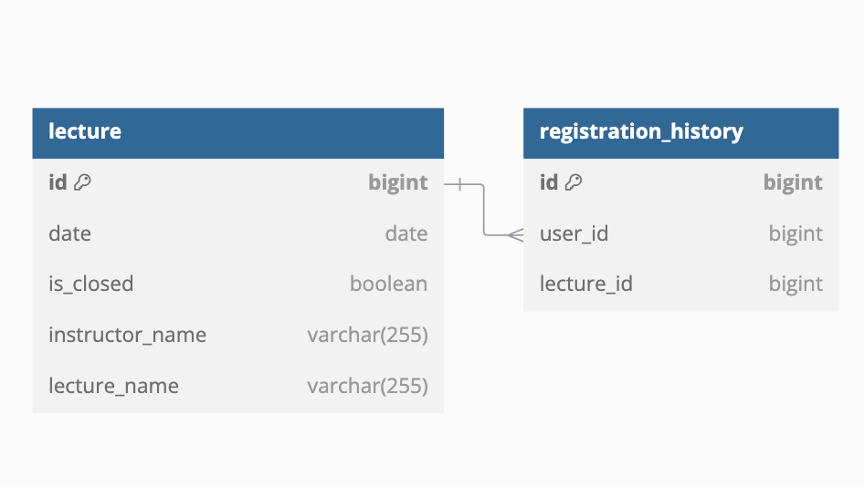
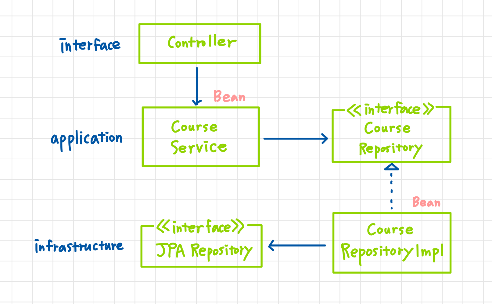

# [2주차 과제] 특강 신청 서비스

## 📝 개요

특강 신청 요청을 받으면 제약 조건에 따라 결과를 반환하는 API 입니다. <br>
ERD + Layer + Entity 를 설명하고 이와 같은 구조를 선택한 이유를 작성한 보고서 입니다.

---

## 🛠 기술 스택

- **Java**: 21
- **Spring Boot**: 3.4.1
- **JPA**: Hibernate
- **Database**: MySQL
- **Build Tool**: Gradle
- **IDE**: IntelliJ IDEA

---

## 📊 ERD



---

## 🏗️ Layer
- 1차 설계<br>
  고수준의 모듈이 저수준의 모듈에 의존하지 않기 위해 ioc 방식으로 레이어를 설계했습니다.
  하지만 작은 규모의 프로젝트임에도 다소 복잡한 구조로 구현 생산성이 떨어졌습니다.
  멘토링에서 구현의 편리함이 DIP가 주는 다른 장점(변경의 유연함, 테스트가 쉬움)만큼 중요하며,
  구현 클래스가 2개 이상이 될 가능성이 없다면 굳이 생산성을 떨어트리지 말자는 피드백을 받았습니다.
  
- 최종 설계<br>
  이후 application 영역이 infrastructure 영역을 의존하는 구조로 설계를 변경했습니다.
  해당 프로젝트는 구현 기술이 변경될 일이 없기 때문에 DIP를 완벽히 준수하지 않았습니다.
  '특강'과 '신청'은 동일한 관심사라고 생각되어 MSA 방식으로 구성했습니다.
  JPA의 편리함을 가져가면서 개발의 생산성도 높일 수 있는 방식이라고 생각합니다.
    - interfaces<br>
      application -> infrastructure


## 🏗️ Entity

**제약 조건**:
- 모든 강의의 정원은 30명으로 정원을 초과해 신청할 수 없다.
- 학생은 동일한 강의에 두 번 이상 등록할 수 없다. <br>
  -> 제약 조건 처리를 위해 Entity id를 조회해 개수를 count해서 조건에 맞지 않다면 예외 처리 하도록 구현했습니다.


```java
public class Lecture {
  @Id
  @GeneratedValue(strategy = GenerationType.IDENTITY)
  private Long id;
  
  private LocalDate date;
  
  private Boolean isClosed;
  
  @OneToMany(mappedBy = "lecture")
  private List<RegistrationHistory> histories;
  
  private String lectureName;
  
  private String instructorName;
}
```
```java
public class RegistrationHistory {
  @Id
  @GeneratedValue(strategy = GenerationType.IDENTITY)
  private Long id;
  
  @ManyToOne
  @JoinColumn(name = "lecture_id")
  private Lecture lecture;
  
  private Long userId;
}
```

## 📝 회고
처음에는 클린 아키텍처로 설계하기 위해 기존에 알려진 구조를 무작정 따라했습니다.
<br>이번 프로젝트를 하며 '필요에 의한' 구현을 하는 연습을 했습니다.
<br>좋은 기술을 사용하는 것도 중요하지만, 목적과 가장 어울리게 개발하는 방식을 고민해볼 수 있던 시간이었습니다.
<br>정답을 찾아 얽메이지 않고 유연하게 생각할 수 있도록 도와주신 코치님께 감사합니다.
<br>시간 상 비즈니스 로직을 맘에 들게 구현하진 못했지만,
<br>리팩토링을 통해 제약 조건 처리 방식을 개선하고, dto와 mapper를 사용해 컨트롤러 반환 작업을 개선하고자 합니다.